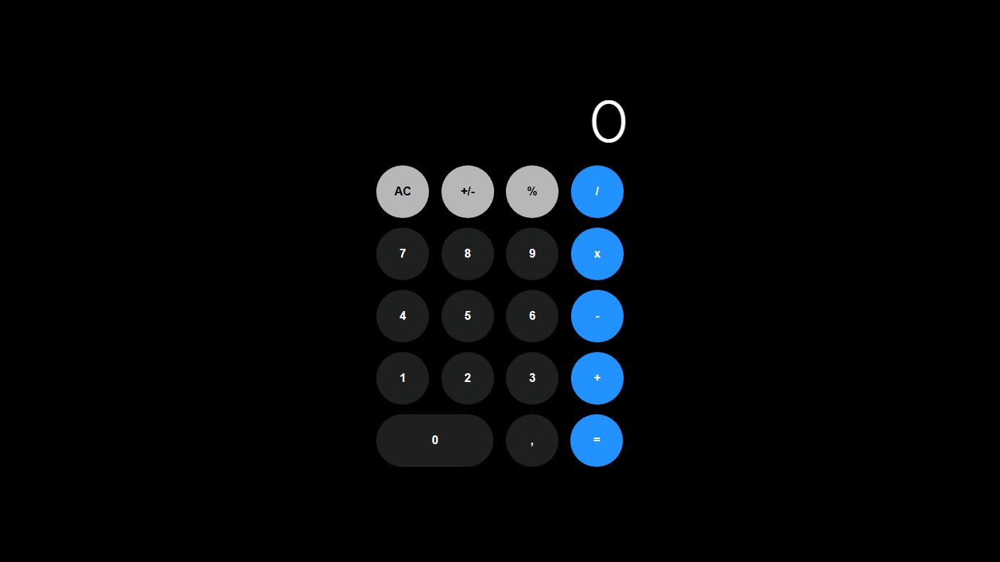

# Calculadora
Calculadora completamente funcional, feita por mim, em JavaScript. Utilizei o modelo de calculadora do iphone e alterei cores.

  
# Calculadora

Calculadora completamente funcional, feita por mim, em JavaScript. Utilizei o modelo de calculadora do iphone e alterei cores. Contém operações de soma, subtração, multiplicação, divisão e de porcentagem.

## 🔨 Funcionalidades do projeto

Calculadora completamente funcional, feita por mim, em JavaScript. Utilizei o modelo de calculadora do iphone e alterei cores. Contém operações de soma, subtração, multiplicação, divisão e de porcentagem.

## ✔️ Técnicas e tecnologias utilizadas

- `Funcionalidade 1`: HTML. Linguagem de marcação..
- `Funcionalidade 2`: CSS. Linguagem para estilização do html.
- `Funcionalidade 3`: Javascript. Linguagem de programação.

## 📁 Acesso ao projeto

[Clique aqui para acessar](https://ericksilverio00.github.io/Adivinhacao/)

## 🛠️ Abrir e rodar o projeto

Para abrir e rodar o projeto basta clicar nos ícones de navegação.
